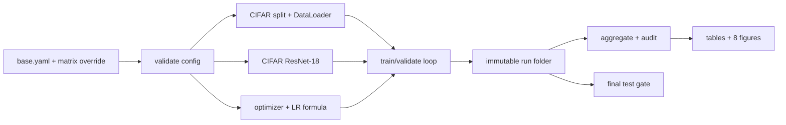

# Phân tích triển khai đề tài 3

## 1. Bài toán thật sự cần giải

Đây không phải cuộc thi tìm accuracy cao nhất. Biến đầu ra của dự án là **bằng chứng thực nghiệm có kiểm soát** cho ba câu hỏi:

1. Kỹ thuật thay đổi tốc độ hội tụ ra sao?
2. Kỹ thuật thay đổi khả năng tổng quát hóa ra sao?
3. Chênh lệch quan sát được có lớn hơn dao động giữa hai seed không?

Vì vậy một codebase “train được” vẫn chưa đủ. Cần chống ba lỗi nguy hiểm hơn lỗi model: thay nhiều biến cùng lúc, dùng test để tune, và chép số từ log sang báo cáo sai.

## 2. Giả định phạm vi

Base code chọn phương án ít rủi ro nhất trong Kickoff:

- CIFAR-10, không chọn CIFAR-100.
- 45k/5k từ tập train chính thức, split seed 4653; test 10k giữ kín.
- ResNet-18 CIFAR, 20 epoch tối đa.
- Hai training seed 42 và 2026.
- Validation accuracy chọn checkpoint; validation loss điều khiển early stopping.
- Dropout chỉ đặt sau global average pooling.
- Augmentation là crop 32 với padding 4, flip ngang p=0.5, color jitter 0.1.
- LayerNorm2d chuẩn hóa riêng từng ảnh trên C×H×W; GroupNorm dùng tối đa 8 group.

Các giá trị LR, step size, warm-up, weight decay và patience đang là **pilot proposal**. Nhóm phải chốt sau smoke/overfit/LR finder, trước official runs.

## 3. Sửa phép đếm thí nghiệm

Kickoff có một mâu thuẫn nội bộ:

- Bảng đầu nói regularization có 8 cấu hình và suy ra 26 unique configs / 52 runs.
- Danh sách chi tiết lại có 9 cấu hình, thêm `weight decay + augmentation`.

Theo danh sách chi tiết:

| Nhánh | Số cấu hình |
|---|---:|
| Optimizer | 6 |
| Schedule × warm-up | 6 |
| Regularization | 9 |
| Normalization × batch size | 9 |
| Tổng trước dedup | 30 |

Một shared anchor đồng thời là SGD+momentum trong optimizer, constant/no-warm-up trong schedule, BN/batch-128 trong normalization và weight-decay-only trong regularization. Nó xuất hiện bốn lần nhưng chỉ chạy một lần, nên `30 - 3 = 27` unique configs; hai seed tạo **54 official runs**.

Base code chọn 54 để không bỏ sót yêu cầu chi tiết. Nhóm nên hỏi giảng viên liệu cấu hình `WD + augmentation` có bắt buộc; nếu thầy xác nhận chỉ 8 regularization configs thì bỏ đúng entry đó và cập nhật checker về 52.

## 4. Kiến trúc đơn giản

Pattern được dùng:

- **Config as contract:** một YAML resolve đầy đủ trước khi train; lỗi tên/giá trị dừng sớm.
- **One implementation point:** optimizer chỉ ở `optimization.py`, normalization chỉ ở `model.py`; không có ba bản notebook lệch nhau.
- **Factory nhỏ, tường minh:** một chuỗi `if` ánh xạ tên sang lớp PyTorch, không registry động.
- **Immutable run:** không ghi đè log cũ; config và môi trường đi cùng kết quả.
- **Test firewall:** train loader không hề tạo test set; lệnh test riêng đòi `--confirm-final`.
- **Single source of truth:** CSV/bảng/biểu đồ sinh từ `summary.json` và metrics CSV.

## 5. Một run diễn ra thế nào

1. Load base YAML, áp override, validate.
2. Seed Python, NumPy, PyTorch, CUDA và DataLoader worker.
3. Ghi config resolved + version/GPU/git commit.
4. Tạo đúng split và ghi checksum.
5. Tạo ResNet cùng seed; chỉ normalization/dropout được thay theo nhánh.
6. Mỗi batch: đặt LR → zero gradient → forward → cross-entropy → backward → optimizer step → log.
7. Mỗi epoch: validation; checkpoint nếu accuracy tốt hơn; xét early stop nếu cấu hình bật.
8. Ghi summary và trạng thái completed/failed.

Thứ tự `LR → forward/backward → optimizer.step` được cố định để warm-up step 0 không mơ hồ.

## 6. Metric và cách diễn giải

Mỗi run lưu train/val loss, train/val accuracy, generalization gap, LR, thời gian, best epoch, mean validation accuracy qua các epoch và epoch đầu đạt ngưỡng convergence. Train metric online vẫn được log trên các batch đã augment, nhưng cuối run model được đánh giá thêm đúng một lần trên toàn bộ train set với transform sạch; biểu đồ generalization gap dùng giá trị sạch này để so công bằng với validation.

- Tốc độ hội tụ: loss theo optimizer step, epoch đạt ngưỡng, mean accuracy-over-epochs.
- Tổng quát hóa: best validation accuracy và train−validation gap.
- Chi phí: total seconds, nhưng chỉ đối chiếu cùng GPU.
- Độ bất định: mean ± sample std của hai seed.

Không gọi hai seed là “statistically significant”. Quy tắc kết luận đề xuất:

- Cùng xu hướng ở hai seed và chênh lệch lớn rõ so với std: “kết quả cho thấy… trong thiết lập này”.
- Chênh lệch xấp xỉ std hoặc hai seed đảo chiều: “chưa đủ bằng chứng”.
- Không ngoại suy “optimizer X luôn tốt nhất”.

## 7. Gate trước khi chạy 54 runs

- [ ] Ba máy dùng cùng commit, Python, torch, torchvision.
- [ ] `check_configs`, unit tests và fake smoke đều qua.
- [ ] Overfit 128 ảnh ≥ 90%.
- [ ] Hai lần chạy pilot cùng seed cho curve/metric khớp trong dung sai đã chốt.
- [ ] LR finder cho đủ sáu optimizer với cùng số step và dữ liệu.
- [ ] Chốt LR, RMSProp momentum, WD protocol, warm-up 2 epoch, step interval/gamma, cosine min LR.
- [ ] Chốt LayerNorm definition và GroupNorm group count trong báo cáo.
- [ ] Xác nhận 9 regularization configs với giảng viên.
- [ ] Pilot 20 epoch để ước lượng lại GPU-hours; chia queue nếu quota không đủ.
- [ ] Matrix review chéo và đổi `approved: true`.

## 8. Rủi ro và phương án

| Rủi ro | Dấu hiệu | Xử lý |
|---|---|---|
| LR không công bằng | optimizer diverge ngay | LR finder cùng budget, chốt trước official seeds |
| Adam = AdamW | WD bằng 0 | giữ cùng WD dương trong optimizer branch |
| Test leakage | test được gọi nhiều lần | chỉ `evaluate_test.py`, lưu timestamp và từ chối ghi đè |
| Split khác máy | checksum khác | dừng merge, không dùng chung số liệu |
| BatchNorm batch nhỏ không giảm | kết quả trái kỳ vọng | báo trung thực; kiểm batch cuối, curve và implementation |
| Hai seed nhiễu | thứ hạng đảo | ghi chưa đủ bằng chứng; nếu còn GPU, thêm seed như mở rộng |
| Kaggle ngắt phiên | `status=failed` | giữ artifact, chạy cùng id với `experiment.attempt=retry1`; không nối log thủ công |
| Timing sai | GPU khác nhau | lọc theo `gpu_name`; không trộn Kaggle/Colab |
| 54 runs quá quota | pilot lâu hơn dự kiến | ưu tiên toàn bộ bắt buộc, bỏ extension trước; hỏi thầy về cấu hình thứ 9 |

## 9. Definition of done

Dự án chỉ hoàn thành khi code chạy từ môi trường sạch theo README; audit không có lỗi; 54 runs (hoặc con số thầy xác nhận) có log; ≥6 hình tự sinh; bảng/report/log khớp; test chỉ dùng sau freeze; và mỗi thành viên trả lời được cả pipeline chung lẫn nhánh mình.
